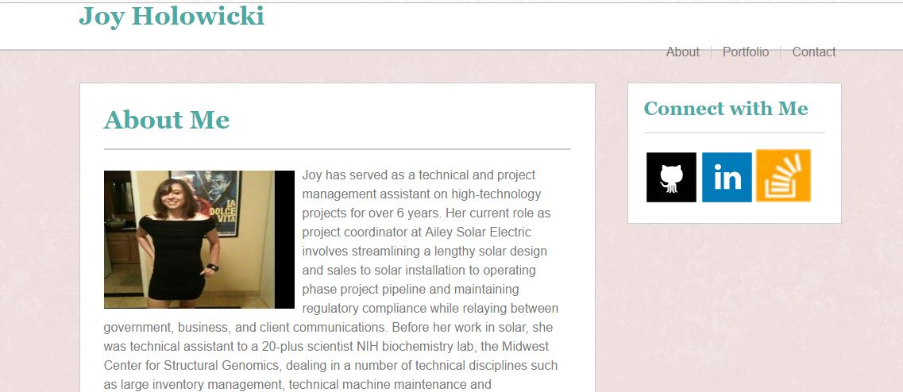

# Basic-Portfolio
> A professional portfolio site.


A professional portfolio site built with HTML and CSS styling. Demonstrates a zero-to-layout build.



## Download

OS X & Linux:

```sh
git clone https://github.com/jholowicki/Basic-Portfolio.git
```

Windows:

```sh
git clone https://github.com/jholowicki/Basic-Portfolio.git
```

## Usage example

A simple static site build for a website in the future.


## Release History

* 0.2.1
    * CHANGE: Portfolio.html functionality
    * ADD: layout design CSS
* 0.2.0
    * CHANGE: Update docs
* 0.1.0
    * The first proper release
    * CHANGE: Submission for class assignment
* 0.0.1
    * Work in progress

## Meta

Joy Holowicki – [@JoycodesJS](https://twitter.com/joycodesjs) – joyholowicki@gmail.com

Distributed under the MIT license. 

[https://github.com/jholowicki/Basic-Portfolio](https://github.com/jholowicki/)

